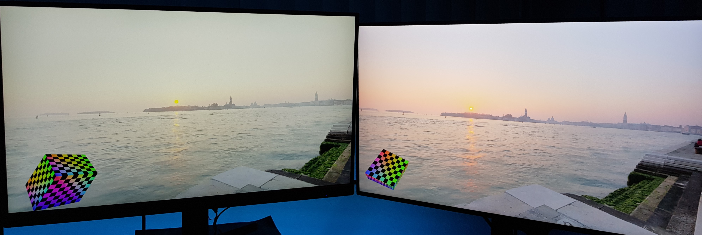

# VQE

VQE is **VQEngine**: A DX12 rewrite of [VQEngine-Vanilla](https://github.com/vilbeyli/VQEngine) for fast prototyping of rendering techniques and experimenting with cutting-edge technology.

# Features

 - Multi-threaded architecture
   - Main, Update & Render Threads
   - ThreadPool of worker threads
 - HDR Environment Maps from [HDRI Haven](https://hdrihaven.com/)
 - HDR display support
 
 - Multiple windows on multiple monitors
 - Physically-based Rendering (WIP)
 - Real-time and offline Ray Tracing (WIP)
 - Automated build & testing

See [Releases](https://github.com/vilbeyli/VQE/releases) to download the source & pre-built executables.

# Build

Make sure to have pre-requisites installed 

- [CMake 3.4](https://cmake.org/download/)
- [Visual Studio 2019](https://visualstudio.microsoft.com/downloads/)
- [Windows 10 SDK 10.0.18362.0](https://developer.microsoft.com/en-us/windows/downloads/windows-10-sdk)

To download the textures, run

 - `Scripts/DownloadAssets.bat`

Then, run one of the build scripts in `Build/` folder,

- `GenerateSolutions.bat` to build from source with Visual Studio
  - `VQE.sln` can be found in `Build/SolutionFiles` directory
- `PackageEngine.bat` to build and package the engine in release mode and open `_artifacts` folder
  - `VQE.exe` can be found in `Build/_artifacts` directory

# Run

Make sure to have installed

 - [Visual C++ 2019 Redistributiable (x64)](https://support.microsoft.com/en-us/help/2977003/the-latest-supported-visual-c-downloads)
 - A DX12-capable GPU

Run `VQE.exe`.

## Controls

| | |
| :--: | :-- |
| **WASD+EQ** | Camera Movement |
| **Page Up/Down** | Change Environment Map |
| **V** | Toggle VSync |
| **M** | Toggle MSAA |
| **Alt+Enter** | Toggle Fullscreen |
| **Spacebar** | Toggle Cube Animation |
| **Mouse Buttons** | Rotate Cube |
| **Esc** | Release mouse |

## Settings

VQE can be configured through `Data/EngineConfig.ini` file

| Graphics Settings | |
| :-- | :-- |
| `ResolutionX=<int>` | Sets application render resolution width | 
| `ResolutionY=<int>` | Sets application render resolution height |
| `VSync=<bool>`   | Toggles VSync based on the specified `<bool>` |
| `AntiAliasing=<bool>` | Toggles MSAA based on the specified `<bool>` |
| `MaxFrameRate=<int>` | Sets maximum frame rate to the specified `<int>` |
| `HDR=<bool>` | Toggles HDR swapchain & HDR display support |

 

| Engine | |
| :-- | :-- |
| `Width=<int>` | Sets application main window width | 
| `Height=<int>` | Sets application main window height |
| `DisplayMode=<Windowed/Fulscreen>` | Sets Sets application main window mode: Windowed or Fullscreen |

## Command Line 

VQE supports the following command line parameters:

| CMD Line Parameter | Description  |
| :-- | :-- |
| `-LogConsole` | Launches a console window that displays log messages |
| `-LogFile=<string>` | Writes logs into an output file specified by `%FILE_NAME%`.    ***Example**: `VQE.exe -LogFile=Logs/log.txt`  will create `Logs/` directory if it doesn't exist, and write log messages to the `log.txt` file*
| `-Test` | Launches the application in test mode:   The app renders a pre-defined amount of frames and then exits. |
| `-TestFrames=<int>` | Application runs the sepcified amount of frames and then exits.  Used for Automated testing.    ***Example**: `VQE.exe -TestFrames=1000`* |
| `-W=<int>`   `-Width=<int>` | Sets application main window width to the specified amount |
| `-H=<int>`   `-Height=<int>` | Sets application main window height to the specified amount |
| `-ResX=<int>` | Sets application render resolution width |
| `-ResY=<int>` | Sets application render resolution height |
| `-FullScreen` | Launches in fullscreen mode |
| `-Windowed` | Launches in windowed mode |
| `-VSync` | Enables VSync |
| `-VSync=<bool>` | Sets Specified VSync State |
| `-AntiAliasing` or `-AA` | Enables [MSAA](https://mynameismjp.wordpress.com/2012/10/24/msaa-overview/) |
| `-TripleBuffering` | Initializes SwapChain with 3 back buffers |
| `-DoubleBuffering` | Initializes SwapChain with 2 back buffers |

**Note:** Command line parameters will override the `EngineSettings.ini` values.

# Scripts

| File |  |
| :-- | :-- |
| `GenerateSolutions.bat` | **What it does**  - Initializes the submodule repos  - Runs `CMake` to generate visual studio solution files in `Build/SolutionFiles` directory   - Launches Visual Studio     **Flags**   - `noVS` : Updates/Generates `VQE.sln` without launching a Visual Studio instance    ***Example** : `GenerateSolutions.bat -noVS`   while VS is open to update solution files after modifying CmakeLists.txt without closing/relaunching VS*
| `PackageEngine.bat` | **What it does**    - Runs `GenerateSolutions.bat` if the visual studio solution doesn't exist   - Builds the engine in Release configuration   - Moves build output into `Build/_artifacts` folder     **Flags**   `-Clean` : Runs Clean on `VQE.sln` projects before building   `-DebugOnly` : Builds the Debug binaries only   `-Debug` : Builds Debug binaries in addition to Release   `-RelWithDebInfo` : Builds the Release binaries with Debug info in addition to Release       ***Note**: Release build is always on by default, unless `-DebugOnly` is specified*    ***Example**: `PackageEngine.bat -Clean -Debug -RelWithDebInfo `  will build all configurations after running Clean and copy the binaries into `Build/_artifacts` folder*
| `TestVQE.bat` | **What it does**   - Runs `VQE.exe` with testing parameters, making the engine exit after rendering specified number of frames (1000 default).    **Flags**   `-Debug`: Tests the Debug build in addition to the Release build   

# 3rd-Party

- [D3DX12](https://github.com/microsoft/DirectX-Graphics-Samples/tree/master/Libraries/D3DX12)
- [D3D12MA](https://github.com/GPUOpen-LibrariesAndSDKs/D3D12MemoryAllocator)
- [stb](https://github.com/nothings/stb)
- [tinyxml2](https://github.com/leethomason/tinyxml2)